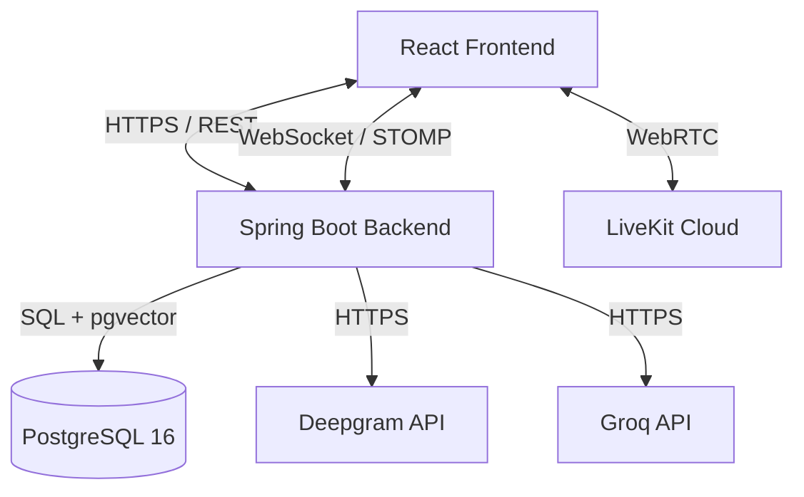

# Architecture

## Component Diagram

*Note: No separate FastAPI ML sidecar or standalone vector DB exists in the codebase. The backend uses Java for embeddings and AI endpoints, and pgvector is hosted inside the primary PostgreSQL database.*

## Request Lifecycle

### Typed Chat Message (Channel)
1. User types message and hits send in the React frontend.
2. Frontend sends a STOMP message to `/app/channel/{channelId}/send` over the WebSocket tunnel (`/ws`).
3. Spring Boot's `ChannelChatController` intercepts it.
4. `ChannelService` persists the message to the `channel_messages` table in Postgres.
5. The message is broadcast via STOMP to `/topic/channel/{channelId}`.
6. Connected clients receive the payload and update their UI.

### Call with Transcription
1. Frontend requests a LiveKit token from REST endpoint `/api/channels/{id}/call-token`.
2. Frontend joins the LiveKit WebRTC room.
3. During the call, the backend initiates a Deepgram transcription (or frontend uploads a recording via `/api/channels/{id}/recording` and triggers `/api/channels/{id}/transcribe`).
4. `DeepgramService` processes the audio.
5. The generated transcript is stored in Postgres (`call_transcripts` table) via `CallTranscriptRepository`.
6. AI endpoints (`/api/channels/{id}/ask`) can later query memories and transcripts from Postgres and pass them to Groq for answer synthesis.

## WebSocket / STOMP vs REST
- **REST**: Used for static operations, authentication (`/auth/*`), fetching history (`/api/channels/{id}/messages`), settings, token generation (`call-token`), and AI queries (`/ask`).
- **WebSocket / STOMP**: Used for real-time bidirectional events. The frontend connects to `/ws` and subscribes to:
  - `/topic/public` (global online user presence)
  - `/topic/channel/{channelId}` (channel messages)
  - `/user/{username}/queue/dm` (direct messages)
  Messages are sent via endpoints like `/app/channel/{channelId}/send` and `/app/dm.sendMessage`.
